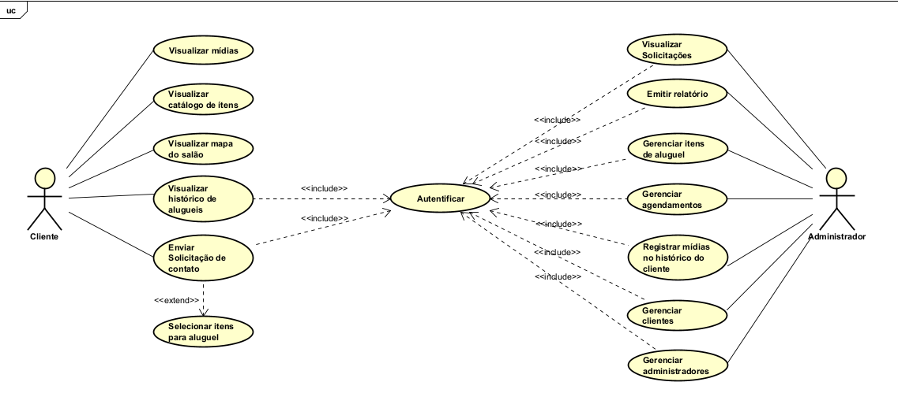

# Especificações do Projeto

Pré-requisitos: <a href="1-Documentação de Contexto.md"> Documentação de Contexto</a>

Definição do problema e ideia de solução a partir da perspectiva do usuário. É composta pela definição do  diagrama de personas, histórias de usuários, requisitos funcionais e não funcionais além das restrições do projeto.

Apresente uma visão geral do que será abordado nesta parte do documento, enumerando as técnicas e/ou ferramentas utilizadas para realizar a especificações do projeto

## Personas

Persona 1 – Visitante do Site

Ana Cláudia tem 29 anos, é Promotora de vendas e trabalha em horário comercial. No pouco tempo livre que tem, costuma pesquisar pelo celular opções de salões de festas para organizar eventos da família. Ela valoriza sites que tragam fotos e vídeos reais, pois gosta de visualizar como seria o espaço decorado para o seu evento. Também prefere encontrar tudo de forma prática, como catálogo de itens para aluguel e localização no mapa. Muitas vezes chega ao site do salão a partir de uma busca no Google, já que não tem paciência para navegar em redes sociais ou aplicativos complicados.

Persona 2 – Cliente

Roberto Silva tem 35 anos, é motorista de aplicativo e pai de uma menina de 7 anos. Está planejando uma festa de aniversário para a filha e precisa de um processo simples, já que sua rotina é corrida e seu tempo, limitado. Ele busca praticidade para solicitar orçamentos, agendar a festa, acompanhar a data e horário e também status do pagamento em caso de esquecimento. Roberto valoriza poder salvar seus dados no sistema para não ter que preencher tudo novamente em cada contato, para ele, o mais importante é ter clareza e rapidez em cada etapa da contratação, garantindo que tudo esteja organizado sem precisar perder tempo com burocracias.

Persona 3 – Administrador/Gerente do Salão

Carlos Mendes tem 40 anos, é proprietário do salão de festas e responsável por toda a gestão do negócio. Apesar de não ser especialista em tecnologia, usa aplicativos em seu dia a dia e procura soluções simples e objetivas. Carlos precisa de uma ferramenta que facilite o controle de agendamentos, cadastros de clientes, atualização do catálogo e acompanhamento financeiro. Ele se sente sobrecarregado quando precisa organizar tudo manualmente em planilhas e anotações. Por isso, deseja um sistema que centralize todas as informações, permita gerar relatórios rápidos e ajude a manter o salão funcionando de forma organizada e profissional.

## Histórias de Usuários

|EU COMO... `PERSONA`| QUERO/PRECISO ... `FUNCIONALIDADE` |PARA ... `MOTIVO/VALOR`                 |
|--------------------|------------------------------------|----------------------------------------|
| Visitante do site | Visualizar fotos e vídeos que expõem o salão | Conhecer o espaço e ter uma ideia de como meu evento poderia ser |
| Visitante do site | Ver um catálogo com os itens disponíveis para aluguel | Saber tudo que o salão oferece para a minha festa |
| Visitante do site | Ver a localização do salão em um mapa | Saber como chegar ao local facilmente |
| Cliente | Realizar um cadastro e login rápidos | Salvar minhas informações para solicitar um agendamento e ver meu histórico |
| Cliente | Enviar um formulário de contato | Entrar em contato com o salão fácilmente |
| Cliente | Selecionar itens de interesse e agregá-los ao formulário de contato | Solicitar um orçamento ou agendamento de forma rápida |
| Cliente | Acessar um histórico dos meus alugueis passados | Relembrar os detalhes, itens contratados e ver as recordações das festas |
| Administrador | Gerenciar os itens disponíveis para aluguel pelo aplicativo | Manter o catálogo do site sempre atualizado |
| Administrador | Receber as solicitações de contato/agendamento feitas pelo site | Organizar e responder aos potenciais clientes de forma eficiente |
| Administrador | Cadastrar e consultar as informações dos meus clientes | Ter um controle de quem são meus clientes e seus contatos |
| Administrador | Gerenciar os agendamentos das festas (confirmar, alterar status, etc.) | Manter a agenda do salão organizada e sob controle |
| Administrador | Registrar informações das festas, como status de pagamento | Fazer a gestão financeira de cada evento |
| Administrador | Gerar relatórios simples (ex: festas do mês, valores pendentes) | Ter uma visão geral da saúde financeira e operacional do negócio |

## Requisitos

As tabelas que se seguem apresentam os requisitos funcionais e não funcionais que detalham o escopo do projeto. Para determinar a prioridade de requisitos, aplicar uma técnica de priorização de requisitos e detalhar como a técnica foi aplicada.

### Requisitos Funcionais

| ID     | Requisito Funcional                                                                                              | Prioridade |
| ------ | ---------------------------------------------------------------------------------------------------------------- | ---------- |
| RF-001 | O sistema deve permitir que o visitante visualize fotos e vídeos do salão e de eventos anteriores.               | ALTA       |
| RF-002 | O sistema deve exibir o catálogo de itens disponíveis para aluguel.                                              | ALTA       |
| RF-003 | O sistema deve permitir que o visitante visualize a localização do salão em um mapa integrado.                   | MÉDIA      |
| RF-004 | O sistema deve possibilitar cadastro e login simples para clientes.                                              | ALTA       |
| RF-005 | O sistema deve permitir que clientes selecionem itens para aluguel e solicitem o orçamento deles.                | ALTA       |
| RF-006 | O sistema deve permitir que o cliente envie um formulário de contato simples, sem a necessidade de selecionar itens.  | ALTA       |
| RF-007 | O sistema deve notificar o administrador sobre novas solicitações de contato e de orçamento recebido    | ALTA       |
| RF-008 | O sistema deve permitir que clientes visualizem o histórico de pedidos e festas anteriores.                      | MÉDIA      |
| RF-009 | O sistema deve permitir que o administrador cadastre, edite e exclua itens disponíveis para aluguel.             | ALTA       |
| RF-010 | O sistema deve permitir que o administrador gerencie agendamentos de festas (criar, alterar status ou cancelar). | ALTA       |
| RF-011 | O sistema deve permitir que o administrador visualize informações completas dos clientes.                        | ALTA       |
| RF-012 | O sistema deve permitir que o administrador atualize ou cadastre dados dos clientes.                             | ALTA       |
| RF-013 | O sistema deve possibilitar o upload de fotos e vídeos para registro de festas no histórico do cliente.          | MÉDIA      |
| RF-014 | O sistema deve permitir a emissão de um relatório com o resumo mensal de eventos, contendo o número total de festas, o valor total faturado e o valor total pendente  | MÉDIA |
| RF-015 | O sistema deve permitir a visualização de todos os eventos agendados em um determinado período      | MÉDIA      |
| RF-016 | O sistema deve enviar uma notificação para o cliente para informar que o evento está chegando       | BAIXA      |

### Requisitos não Funcionais

| ID      | Requisito Não Funcional                                                                                             | Prioridade |
| ------- | ------------------------------------------------------------------------------------------------------------------- | ---------- |
| RNF-001 | O sistema deve ser responsivo, adaptando-se a desktops, tablets e smartphones.                                      | ALTA       |
| RNF-002 | O sistema deve disponibilizar o aplicativo móvel para Android.                                                      | ALTA       |
| RNF-003 | O sistema deve possuir interface intuitiva e simples, considerando usuários com pouca familiaridade com tecnologia. | ALTA       |
| RNF-004 | O sistema deve processar requisições em até 3 segundos em condições normais de uso.                                 | BAIXA      |
| RNF-005 | O sistema deve armazenar dados no Firebase com autenticação segura.                                                 | ALTA       |
| RNF-006 | O sistema deve suportar múltiplos acessos simultâneos sem comprometer o desempenho.                                 | MÉDIA      |
| RNF-007 | O sistema deve proteger as informações dos clientes de acordo com a LGPD.                                           | ALTA       |
| RNF-008 | O sistema deve seguir padrões modernos de design (UI/UX) para atrair e reter usuários.                              | MÉDIA      |

## Restrições

O projeto está restrito pelos itens apresentados na tabela a seguir.

|ID| Restrição                                             |
|--|-------------------------------------------------------|
|01| O projeto deverá ser entregue até o final do semestre |
|02| O desenvolvimento será feito exclusivamente com React e React Native.        |
|03| O site será destinado aos clientes e o aplicativo móvel apenas para administradores/gerência.      |
|04| A arquitetura será monolítica e simplificada  |
|05| O sistema deverá utilizar exclusivamente o Firebase para banco de dados e autenticação.  |

## Diagrama de Casos de Uso

# Matriz de Rastreabilidade

| ID     | Descrição do Requisito                                                                | Tipo        | Prioridade | Relacionamentos (Casos de Uso / Restrições)                                   |
| :----- | :------------------------------------------------------------------------------------ | :---------- | :--------- | :------------------------------------------------------------------------------ |
| **RF-001** | O sistema deve permitir que o visitante visualize fotos e vídeos do salão.             | Funcional   | ALTA       | UC01 - Visualizar mídias / R02, R05                                             |
| **RF-002** | O sistema deve exibir o catálogo de itens disponíveis para aluguel.                     | Funcional   | ALTA       | UC02 - Visualizar catálogo de itens / R02, R05                                  |
| **RF-003** | O sistema deve permitir que o visitante visualize a localização do salão em um mapa.   | Funcional   | ALTA       | UC03 - Visualizar mapa do salão / R02, R05                                      |
| **RF-004** | O sistema deve possibilitar cadastro e login simples para clientes.                   | Funcional   | ALTA       | UC04 - Autenticar (Cliente) / R02, R05                                          |
| **RF-005** | O sistema deve permitir que os clientes selecionem itens para aluguel e solicitem orçamento. | Funcional   | ALTA       | UC05 - Selecionar itens para aluguel, UC06 - Solicitar orçamento de itens / R02, R05 |
| **RF-006** | O sistema deve permitir que o cliente envie um formulário de contato simples.         | Funcional   | ALTA       | UC07 - Enviar formulário / R02, R05                                             |
| **RF-007** | O sistema deve permitir que os clientes visualizem o histórico de pedidos e festas.    | Funcional   | MÉDIA      | UC08 - Visualizar histórico de alugueis / R02, R05                              |
| **RF-008** | O sistema deve permitir que o administrador cadastre, edite e exclua itens.           | Funcional   | ALTA       | UC09 - Gerenciar itens de aluguel / R02, R05                                    |
| **RF-009** | O sistema deve permitir que o administrador gerencie agendamentos de festas.          | Funcional   | ALTA       | UC10 - Gerenciar agendamentos / R02, R05                                        |
| **RF-010** | O sistema deve permitir que o administrador visualize informações completas dos clientes. | Funcional   | ALTA       | UC11 - Gerenciar clientes / R02, R05                                            |
| **RF-011** | O sistema deve permitir o upload de fotos e vídeos para registro de festas.         | Funcional   | MÉDIA      | UC12 - Registrar mídias no histórico do cliente / R02, R05                      |
| **RF-012** | O sistema deve permitir a emissão de um relatório com resumo mensal de eventos.      | Funcional   | MÉDIA      | UC13 - Emitir relatório / R02, R05                                              |
| **RF-013** | O sistema deve permitir a visualização de eventos agendados em um período.          | Funcional   | MÉDIA      | UC14 - Visualizar agendamentos / R02, R05                                       |
| **RF-014** | O sistema deve enviar notificação ao cliente sobre a proximidade do evento.        | Funcional   | BAIXA      | N/A (Funcionalidade não mapeada em UC específico, mas implícita em RF-013) / R02, R05 |
| **RNF-001**| O sistema deve ser responsivo a diferentes dispositivos.                             | Não Funcional | ALTA       | Usabilidade / R05                                                               |
| **RNF-002**| O sistema deve disponibilizar aplicativo móvel para Android.                        | Não Funcional | ALTA       | Plataforma / R02, R03, R04, R05                                                 |
| **RNF-003**| O sistema deve possuir interface intuitiva e simples.                               | Não Funcional | ALTA       | Usabilidade / R05                                                               |
| **RNF-004**| O sistema deve processar requisições em até 3 segundos.                              | Não Funcional | MÉDIA      | Performance / R02, R05                                                          |
| **RNF-005**| O sistema deve armazenar dados no Firebase com autenticação segura.                   | Não Funcional | ALTA       | Segurança / R02, R05                                                            |
| **RNF-006**| O sistema deve suportar múltiplos acessos simultâneos.                               | Não Funcional | MÉDIA      | Confiabilidade / R02, R05                                                       |
| **RNF-007**| O sistema deve proteger informações dos clientes de acordo com a LGPD.             | Não Funcional | ALTA       | Segurança / R02, R05                                                            |
| **RNF-008**| O sistema deve seguir padrões modernos de design (UI/UX).                            | Não Funcional | MÉDIA      | Usabilidade / R05                                                               |
| **R01** | O projeto deverá ser entregue até o final do semestre.                              | Restrição   | N/A        | Impacta todos os requisitos                                                     |
| **R02** | O desenvolvimento será feito exclusivamente com React e React Native.              | Restrição   | N/A        | RF-001, RF-002, RF-003, RF-004, RF-005, RF-006, RF-007, RF-008, RF-009, RF-010, RF-011, RF-012, RF-013, RF-014, RNF-001, RNF-002, RNF-003, RNF-004, RNF-005, RNF-006, RNF-007, RNF-008 |
| **R03** | O site será destinado a clientes e o aplicativo móvel apenas para administradores. | Restrição   | N/A        | RNF-002                                                                         |
| **R04** | A arquitetura será monolítica e simplificada.                                       | Restrição   | N/A        | N/A (Restrição arquitetural, não diretamente ligada a um requisito específico de funcionalidade ou não funcionalidade) |
| **R05** | O sistema deverá utilizar exclusivamente o Firebase para banco de dados e autenticação. | Restrição   | N/A        | RF-001, RF-002, RF-003, RF-004, RF-005, RF-006, RF-007, RF-008, RF-009, RF-010, RF-011, RF-012, RF-013, RF-014, RNF-001, RNF-002, RNF-003, RNF-004, RNF-005, RNF-006, RNF-007, RNF-008 |

# Gerenciamento de Projeto

De acordo com o PMBoK v6 as dez áreas que constituem os pilares para gerenciar projetos, e que caracterizam a multidisciplinaridade envolvida, são: Integração, Escopo, Cronograma (Tempo), Custos, Qualidade, Recursos, Comunicações, Riscos, Aquisições, Partes Interessadas. Para desenvolver projetos um profissional deve se preocupar em gerenciar todas essas dez áreas. Elas se complementam e se relacionam, de tal forma que não se deve apenas examinar uma área de forma estanque. É preciso considerar, por exemplo, que as áreas de Escopo, Cronograma e Custos estão muito relacionadas. Assim, se eu amplio o escopo de um projeto eu posso afetar seu cronograma e seus custos.

## Gerenciamento de Equipe

A equipe será organizada utilizando o **Kanban do GitHub**, que permite visualizar o fluxo de trabalho e acompanhar o progresso das tarefas de forma simples e transparente.  

### Estrutura do quadro
- **Backlog** → **A Fazer** → **Em Progresso** → **Concluído**  
- Cada tarefa será registrada como **Issue**, com descrição clara e responsável definido.  
- **Labels** ajudarão na categorização (ex.: `feature`, `bug`, `docs`, `prioridade-alta`).  
- **Milestones** serão usados para marcar entregas parciais ou sprints.  

### Rotina da equipe
- **Planejamento semanal:** organizar prioridades e distribuir tarefas.  
- **Daily rápida:** atualização do andamento e identificação de bloqueios.  
- **Revisão:** verificação das entregas e ajustes necessários.  

### Boas práticas
- Limite de tarefas em andamento (**WIP**) para evitar sobrecarga.  
- Pull Requests com revisão obrigatória antes de concluir.  
- Uso de métricas simples como **quantidade de tarefas concluídas** e **tempo médio de execução**.  

## Gestão de Orçamento

