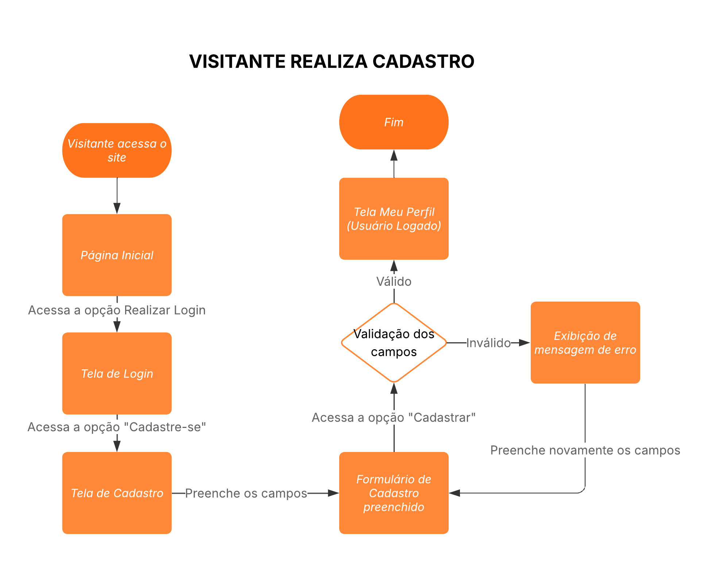

# Projeto de Interface

Pré-requisitos: <a href="2-Especificação do Projeto.md"> Documentação de Especificação</a>

Visão geral da interação do usuário pelas telas do sistema e protótipo interativo das telas com as funcionalidades que fazem parte do sistema (wireframes).

 Apresente as principais interfaces da plataforma. Discuta como ela foi elaborada de forma a atender os requisitos funcionais, não funcionais e histórias de usuário abordados nas <a href="2-Especificação do Projeto.md"> Documentação de Especificação</a>.

## Diagrama de Fluxo

## Site web

### Visitante explora o site

### Visitante realiza o cadastro

### Visitante realiza o login

### Visitante envia solicitação de contato com itens

### Visitante visualiza seu histórico de agendamentos

## Aplicativo Mobile

## Wireframes

### Login

### Login - Esqueci a Senha

### Login - Código para redifinir senha

### Login - Redefinir senha

### Página Inicial

### Página de Relatorios

### Gerencia de  Admins

### Gerencia de  Admins - Excluir

### Gerencia de  Admins - Cadastrar

### Gerencia de  Admins - Editar

### Pagina inicial

### Calendario

### Visualizar Agendamento

### Criar Agendamento

### Criar Agendamento - Adicionar

### Solicitações

### Visualizar Solicitações -

### Configurações -

### Alterar Senha -

### Alterar Email -

 

