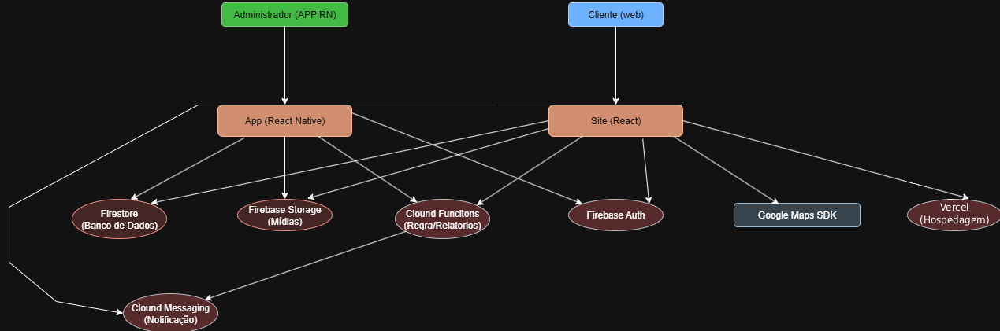
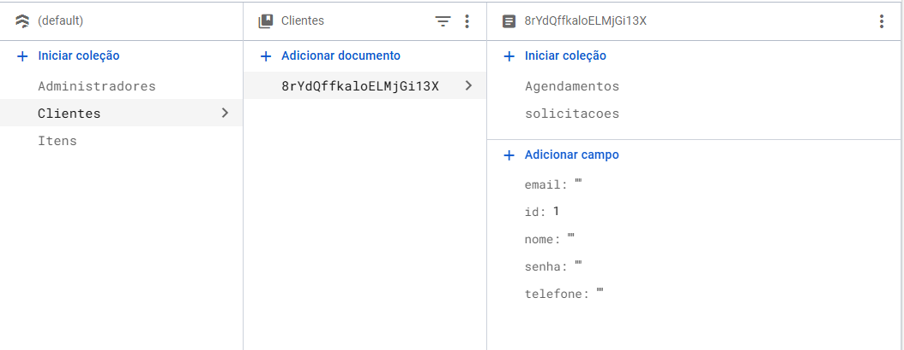
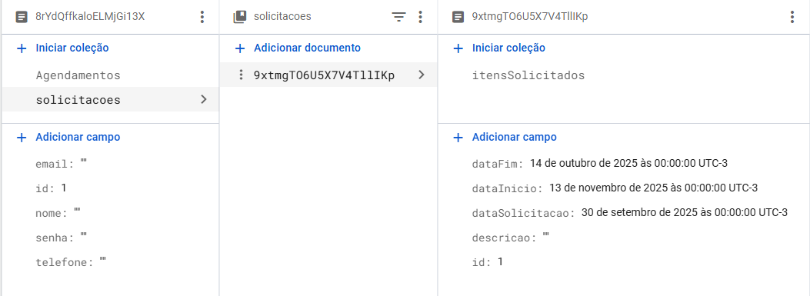
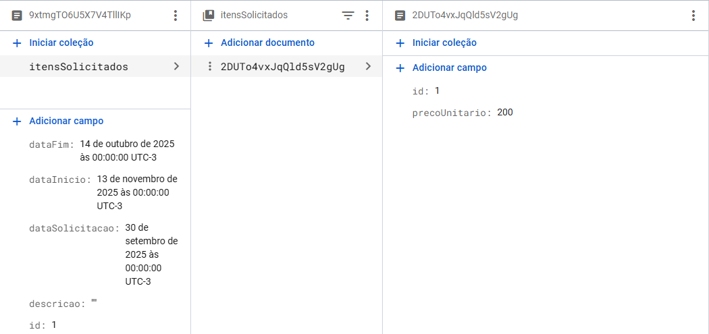
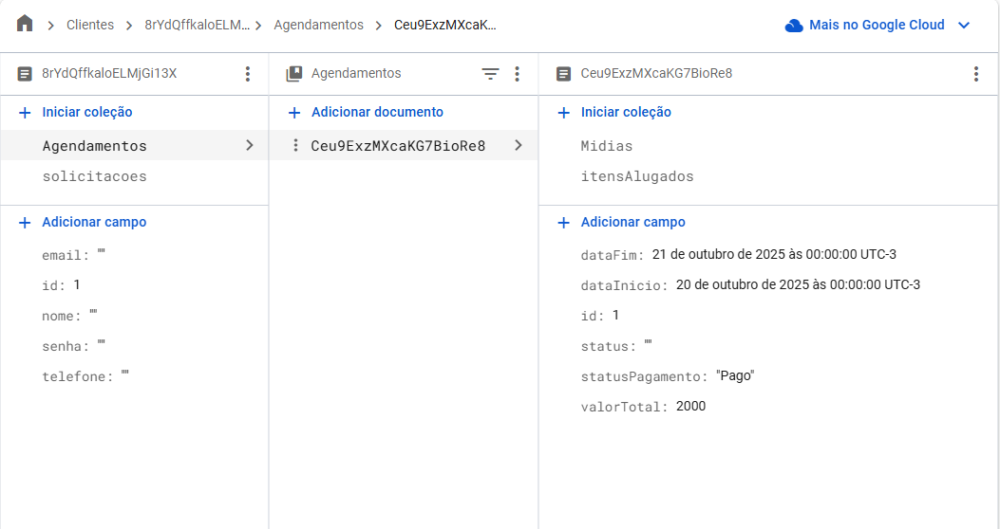
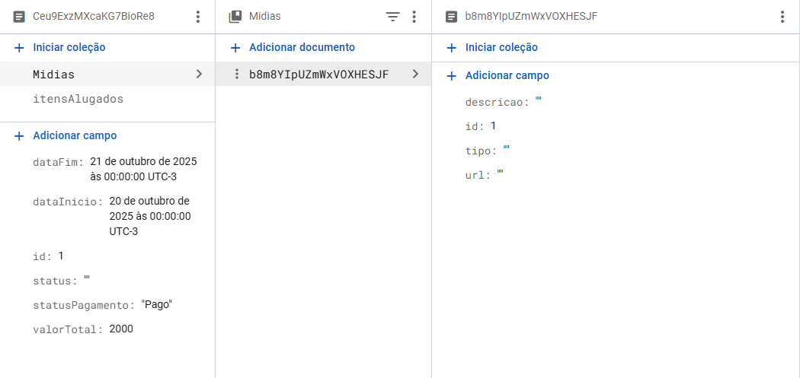
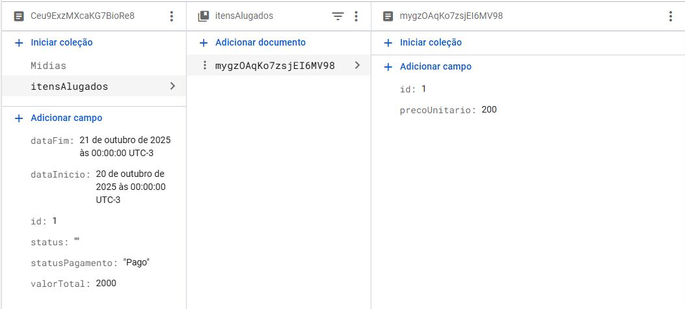
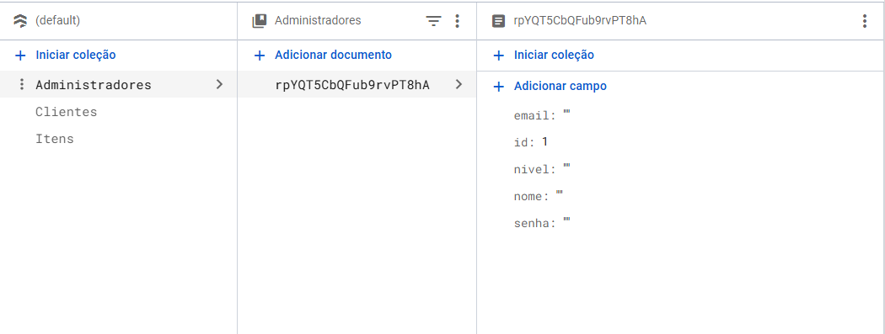
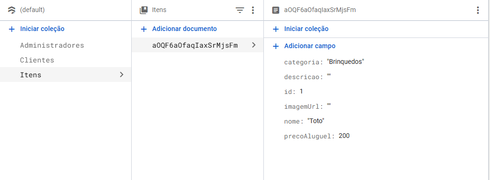

# Arquitetura da Solução

## Diagrama de Classes

## Collections NoSQL

# Hierarquia estrutural

- Clientes
  - Agendamentos
    - Midias
    - ItensAlugados
  - Solicitacoes
    - ItensSolicitados
- Administradores
- Itens

# Clientes

# Administradores

# Itens

## Tecnologias Utilizadas

A solução é composta por um website para clientes e um aplicativo administrativo, ambos integrados a um backend serverless no Firebase.
O desenvolvimento é feito em monorepo GitHub, com VS Code, Git e GitHub Projects (Kanban), apoiado por Figma (design) e Microsoft Teams (comunicação).

| Camada                        | Tecnologia                          | Uso no Projeto                                                                                                                    |
| ----------------------------- | ----------------------------------- | --------------------------------------------------------------------------------------------------------------------------------- |
| **Web (cliente)**             | React                               | Criação de interfaces modernas e responsivas para catálogo, fotos, vídeos, contato e mapa. Atende RF-001, RF-002, RF-003, RF-006. |
| **Mobile (admin)**            | React Native                        | Aplicativo Android para gestão (clientes, itens, agenda, relatórios). Atende RF-008–RF-013, RNF-002.                              |
| **Auth**                      | Firebase Authentication             | Login simples e seguro. Atende RF-004, RNF-005.                                                                                   |
| **Banco de Dados**            | Cloud Firestore (Firebase)          | Dados de clientes, itens, solicitações, agendamentos e histórico (R05).                                                           |
| **Arquivos de mídia**         | Firebase Storage                    | Upload/serving de fotos e vídeos de eventos (RF-013).                                                                             |
| **Lógica/Integrações**        | Cloud Functions for Firebase        | Notificações, relatórios, regras, validações. Suporta RF-007, RF-012, RF-014.                                                     |
| **Notificações**              | Firebase Cloud Messaging (FCM)      | Push notifications (ex.: lembrete de eventos, RF-016).                                                                            |
| **Mapa**                      | Google Maps SDK / react-native-maps | Exibição da localização do salão (RF-003).                                                                                        |
| **Hospedagem Web / CDN**      | Firebase Hosting                    | Deploy do site com HTTPS e cache.                                                                                                 |
| **Analytics/Logs** (opcional) | Firebase Analytics / Crashlytics    | Telemetria, estabilidade e métricas (RNF-006).                                                                                    |

| Categoria         | Ferramenta               | Uso                                                                                           |
| ----------------- | ------------------------ | --------------------------------------------------------------------------------------------- |
| **IDE**           | Visual Studio Code       | Desenvolvimento web/mobile integrado ao Git.                                                  |
| **Versionamento** | Git + GitHub             | Monorepo com branches `main`, `dev`, `testing`, `feature/*`. PRs revisados, tags para marcos. |
| **Gestão**        | GitHub Projects (Kanban) | Backlog → To Do → In Progress → Done; issues com labels e milestones.                         |
| **Design**        | Figma                    | Wireframes e protótipos colaborativos.                                                        |
| **Comunicação**   | Microsoft Teams          | Reuniões, alinhamentos e compartilhamento.                                                    |
| **Build Mobile**  | (Definir futuramente)    | Geração e distribuição do app Android.                                                        |

Bibliotecas e Utilitários

Web (React): react-hook-form, zod, axios/fetch, tanstack-query, shadcn/ui ou MUI, google-maps-react.

Mobile (React Native): react-navigation, react-native-paper ou nativewind, react-query, react-native-maps, react-native-image-picker, react-native-push-notification.

Firebase: SDK modular (firebase), Firestore, Auth, Storage, Functions, Messaging.

Qualidade: ESLint, Prettier, Husky + lint-staged, Jest/RTL, Detox (mobile).

🔗 Relação com Requisitos e Restrições

RF-001/002/003/006 → Website React + Maps + Storage/Firestore.

RF-004 → Firebase Auth.

RF-005/007 → Firestore + Functions (orçamentos + notificações admin).

RF-008–RF-013 → App RN com Firestore/Storage + relatórios (Functions).

RF-014/016 → FCM (notificações).

RNF-001/003/008 → UI responsiva, intuitiva, boas práticas de UX.

RNF-002 → App Android.

RNF-005/007 → Segurança Firebase (Rules) + LGPD.

R02/R05 → Exclusivamente React/React Native e Firebase.

R04 → Arquitetura monolítica simplificada (frontend + backend Firebase).

## Hospedagem

A hospedagem e o lançamento da plataforma foram realizados utilizando a Vercel, uma plataforma moderna especializada na publicação de aplicações web de alta performance, com foco em frameworks de frontend como o React.

O processo de lançamento (deploy) foi configurado usando como controle de versão o Github. Foi enviado um convite para a equipe da PUC permitir que repositório do projeto no Github seja conectado à plataforma Vercel. Este vínculo permitie que o Vercel escute todas as alterações enviadas ao repositório.

Com isso o Deploy é automatizado a cada push para a branch main no repositório github, o Vercel automaticamente inicia o processo de build, deploy e publicação no domínio da aplicação

## Qualidade de Software

Conceituar qualidade de fato é uma tarefa complexa, mas ela pode ser vista como um método gerencial que através de procedimentos disseminados por toda a organização, busca garantir um produto final que satisfaça às expectativas dos stakeholders.

No contexto de desenvolvimento de software, qualidade pode ser entendida como um conjunto de características a serem satisfeitas, de modo que o produto de software atenda às necessidades de seus usuários. Entretanto, tal nível de satisfação nem sempre é alcançado de forma espontânea, devendo ser continuamente construído. Assim, a qualidade do produto depende fortemente do seu respectivo processo de desenvolvimento.

A norma internacional ISO/IEC 25010, que é uma atualização da ISO/IEC 9126, define oito características e 30 subcaracterísticas de qualidade para produtos de software.
Com base nessas características e nas respectivas sub-características, identifique as sub-características que sua equipe utilizará como base para nortear o desenvolvimento do projeto de software considerando-se alguns aspectos simples de qualidade. Justifique as subcaracterísticas escolhidas pelo time e elenque as métricas que permitirão a equipe avaliar os objetos de interesse.

> **Links Úteis**:
>
> - [ISO/IEC 25010:2011 - Systems and software engineering — Systems and software Quality Requirements and Evaluation (SQuaRE) — System and software quality models](https://www.iso.org/standard/35733.html/)
> - [Análise sobre a ISO 9126 – NBR 13596](https://www.tiespecialistas.com.br/analise-sobre-iso-9126-nbr-13596/)
> - [Qualidade de Software - Engenharia de Software 29](https://www.devmedia.com.br/qualidade-de-software-engenharia-de-software-29/18209/)
